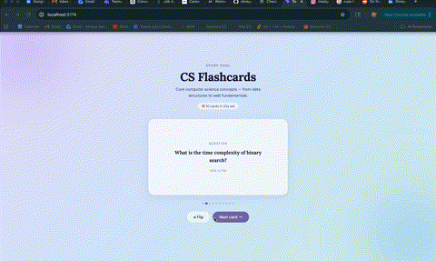

# Flashcard Study App

Submitted by: **Shreya Akula**

This app is a flashcard study tool built around core computer science concepts. Users can flip through cards one at a time, reveal answers, and navigate to a random next card. The design features a soft gradient background with frosted glass cards and Lora serif typography.

Time spent: **3 hours**

## Required Features

The following **required** functionality is completed:

- [x] The title of the card set, a short description, and the total number of cards are displayed
- [x] A single card is displayed at a time
- [x] Only one half of the information pair is shown at a time (question or answer)
- [x] Clicking on a card flips it over and reveals the answer
- [x] Clicking on a flipped card flips it back to show the question
- [x] Clicking the Next button displays a new card selected at random (never the same card twice in a row)

## Video Walkthrough

Here's a walkthrough of the implemented features:

## Notes

The main challenge was managing the flip state across components — specifically making sure the flip resets to false when a new card loads. I solved this by using a `key` prop on the Flashcard component so React remounts it fresh on every "Next card" click, which resets the internal `useState` automatically.

## License

Copyright 2026 Shreya Akula

Licensed under the Apache License, Version 2.0 (the "License");
you may not use this file except in compliance with the License.
You may obtain a copy of the License at

    http://www.apache.org/licenses/LICENSE-2.0

Unless required by applicable law or agreed to in writing, software
distributed under the License is distributed on an "AS IS" BASIS,
WITHOUT WARRANTIES OR CONDITIONS OF ANY KIND, either express or implied.
See the License for the specific language governing permissions and
limitations under the License.
